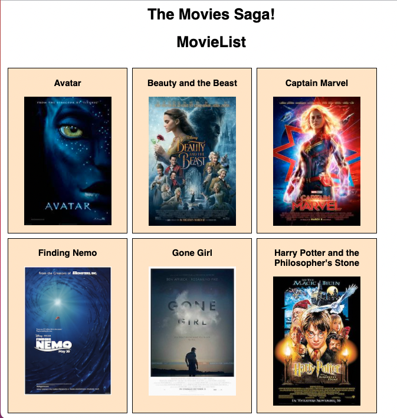

    
    
# Movie Saga

## Table of Contents

- [Description](#description)
- [Screenshots](#screenshots)
- [Built With](#built-with)
- [Getting Started](#getting-started)
- [Usage](#usage)
- [Contacts](#contacts)

## Description

A detailed view of my movie library

## Screenshots

## Built With

## Getting Started

Run these in the terminal

npm install
npm run server
npm run client

### Prerequisites

Must have
PostgreSQL
node

## Contacts

  